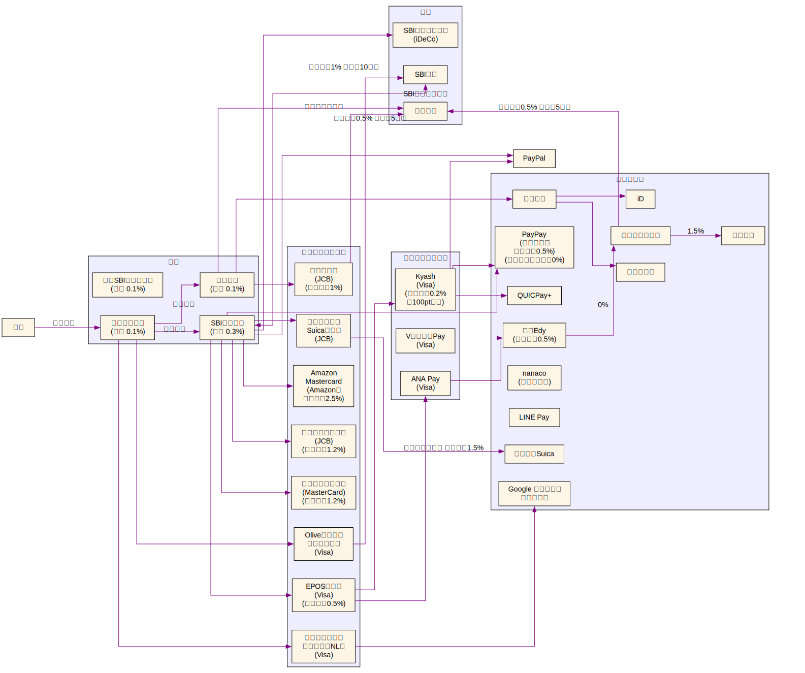

2024年末時点での自分のお金周りの流れやポイ活について整理しておきます

## 方針

- 資産運用は [普通の人が資産運用で99点をとる方法とその考え方 - hayato](https://hayatoito.github.io/2020/investing/) を参考にインデックス投資
- 節税できるところはしていく
- ポイ活は無理のない範囲でやる

## お金の流れ

### ポイント

| ポイント名                | 使用方法                                                               |
| ------------------------- | ---------------------------------------------------------------------- |
| ハピタス                  | ハピタス → .money → dポイント → 日興フロッギーで投資して現金化（予定） |
| Vポイント                 | 三井住友カードの支払い・SBI証券で使用                                  |
| 楽天ポイント              | 楽天証券で使用                                                         |
| JREポイント               | モバイルSuicaで使用                                                    |
| Ponta・リクルートポイント | ホットペッパービューティーで使用                                       |
| エポスポイント            | JRキューポ → Vポイント （予定）                                        |
| Amazonポイント            | Amazonで使用                                                           |

<!--
| ANAマイレージ             |                                                                        |
-->

### 補足・メモ

- 三井住友銀行 を 給与振込口座にすることで Olive で 月200pt
  - [給与受取口座をOliveにするとおトク！ ： 三井住友銀行](https://www.smbc.co.jp/kojin/open-account/salary_new/)
- 最近 SBI新生銀行 を作った。金利が高いこちらをメインバンクにした
- Kyashはポイント還元率が低いので、別になくてもいい
  - クレカチャージできるので、年間利用額の調整するのに便利
- EPOSカードはゴールドへのインビテーション待ち
- dポイント は 増量キャンペーン中に移行するとお得

<!--
- ETC カードが無料で作れるもの
  - リクルートカード(JCB)
  - EPOSカード
-->

#### 三井住友カード ゴールド（NL）のポイント還元率

- [対象のコンビニ・飲食店で最大7％還元！｜クレジットカードの三井住友VISAカード](https://www.smbc-card.com/nyukai/pop/proper_p5.jsp)
  - コンビニの還元率が高い
- 最大効率で還元率2%

計算

- 通常 0.5%
- マイ・ペイすリボの特典 +0.5%
  - ※2024年6月に設定する必要があり、新規での設定は不可
  - 毎月利用額の調整が必要
- 100万円で1万ポイント
- 合計: 年間100万円ぴったり利用すると2万ポイント、還元率2%
- 初年度は年会費5500円で、いわゆる100万円修行で次年度から永年無料
  - 初年度は 年間100万円ぴったり利用すると 還元率1.45%

## 投資信託

- ポートフォリオ
  - S&P500
  - オルカン
- SBI証券
  - 新NISA口座
    - ボーナス月設定で年始に成長投資枠をほぼ埋める
    - 後は積立設定
  - 特定口座
  - iDeCo
- 楽天証券
  - つみたてNISA口座
    - 2023年まで積み立てていた
    - つみたてNISAの非課税期間が2039年に終わるはず
  - 特定口座

### TODO

- dポイント作る
- Oliveプラチナプリファード は 2025/4末で年会費切れるので、そのタイミングでゴールドに切り替える
  - [「三井住友カード つみたて投資」サービス内容改定のお知らせ｜クレジットカードの三井住友VISAカード](https://www.smbc-card.com/mem/cardinfo/cardinfo4010785.jsp) 2024/10月までポイント付与はよかったが、、改悪されたので切り替え
- いままでリクルートカード(JCB)で東海道新幹線乗るときにエクスプレス予約使っていたけど、乗る頻度も減ったので解約してスマートEXに変えていきたい
  - EPOSゴールドなら選べるポイントアップショップ で JR東海 を選ぶと1.5%還元
- LINE Pay は 2025/4 に終了するので案内が出たらPayPayに移行
  - [LINE Payサービス終了に関するお知らせ](https://line-pay-info.landpress.line.me/payment-info/#textGroup_1705769022)
- [2025年以降の他社クレジットカードの利用について - PayPayからのお知らせ](https://paypay.ne.jp/notice/20241205/f-creditcard/)
  - PayPay のKyash紐づけは今後見直すかも

## 普段の生活

- 家計簿は[マネーフォワード ME](https://moneyforward.com/) を使用
- セール活用
  - セール品はあまり興味なく、ポイント還元狙い
    - 緊急度が低いものをメモしておいて買う
  - 楽天スーパーSALE
    - 3, 6, 9, 12月の4日
      - 5と0のつく日にエントリーするとお得
    - ふるさと納税
  - Amazon
    - Kindle まとめ買いキャンペーン
- ハピタス か 楽天リーベイツ 経由で買い物
  - iHerb
  - ユニクロ
  - Apple
  - 楽天トラベル
- セブンイレブンとローソンではクレカのタッチ決済を使う
  - もうnanacoを使う機会がない
- 楽天ペイが使えるところではそれを使う
- 格安SIM [合理的シンプル290プラン｜日本通信SIM](https://www.nihontsushin.com/plan/plansimple.html)
  - 外であまりネットを使わないので平均すると月1000円くらい
    - 出先ではタブレットに入れた電子書籍で暇つぶしすることが多い
    - docomo回線かつMVNOなので駅など電波が悪くて割り切って使っている

## 節税

- ふるさと納税
  - ちゃんと出身地にも寄付している
- 親を扶養にいれる

## 余談

最初は図をMermaidのflowchartで書いていましたが、線が複雑過ぎたのでGraphvizに移行して作成しました。
[dotファイル](https://gist.github.com/hushin/d8680dc54095e1373e648eedf91df591)
