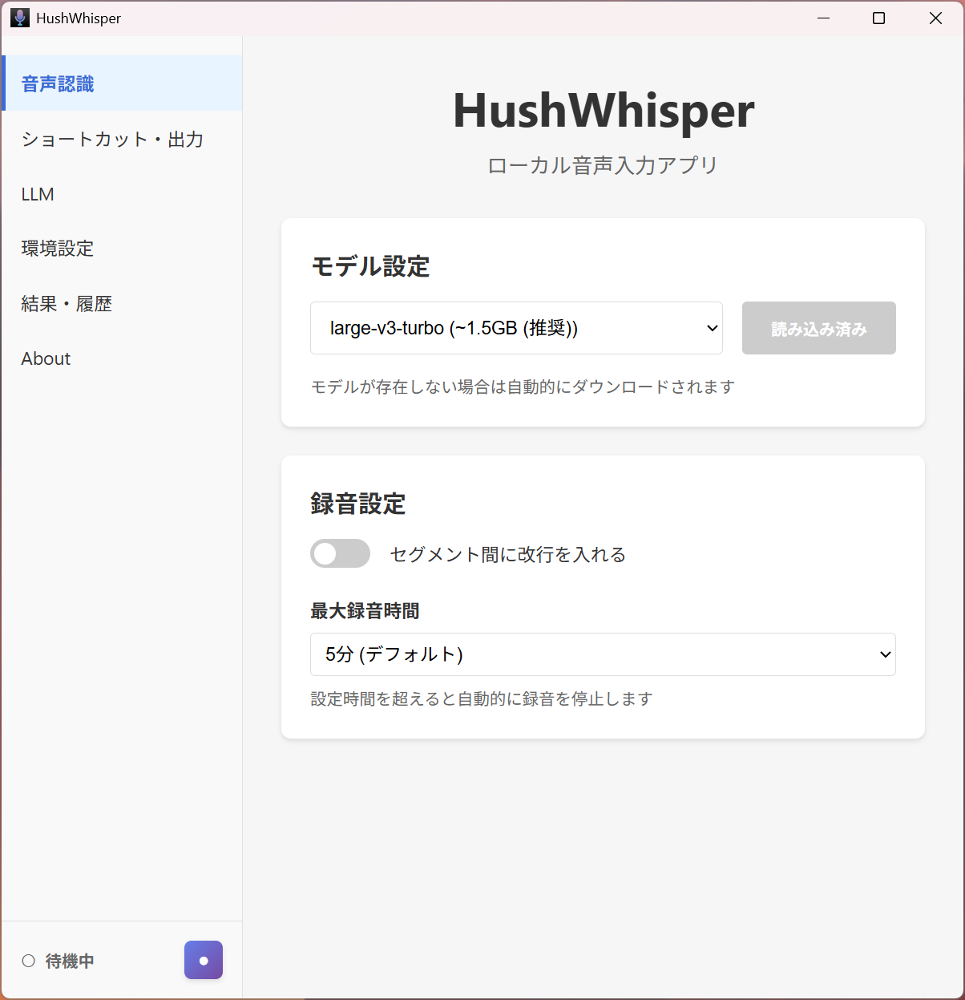

文字入力するときに音声入力を使いたいと思っていた。
SuperWhisper やAqua Voiceなど優れたアプリはあるが、月額料金がかかるのがネックだった。

既存のOSS [Whispering](https://github.com/EpicenterHQ/epicenter/tree/main/apps/whispering) があったが、私の環境だと動かなかった。

無料で使いたいと思い、OpenAIの[Whisper](https://openai.com/ja-JP/index/whisper/)を使ったローカル音声入力アプリをVive Codingで自作した。

作ったアプリはこちら [hushin/hush-whisper](https://github.com/hushin/hush-whisper)

## 機能

- グローバルショートカットで任意アプリ上に音声入力
- LLM による文章整形（Ollama 連携、カスタマイズ可能）
- システムトレイに常駐
- 履歴保存



## 実際の使用感

現在日常的に使っていて、自分が使う分には満足できるクオリティになった。

- 精度の高さ: 文脈が不足していると多少の誤字はあるが高精度。フィラー除去もできている。
- レスポンスの速さ: 数十秒話しても1秒程度で文字起こしができる
- プライバシー: 音声データが外部に送信されない安心感
- 無料: ランニングコストがゼロ

### 使用モデル・PCの環境

- モデル: large-v3-turbo
- GPU: RTX 4070 Ti 12GB
- メモリ: 64GB

### LLM連携

音声認識結果をローカルのOllamaで動かしているLLM（gpt-oss-20b）に渡して整形する処理も実装した。

私のPCスペックだと数秒の入力でも数十秒かかるため、現在は使っていない。もっと軽量なモデルや強いスペックであれば実用的になりそう。

## 開発について

### 技術スタック

- Framework: Tauri 2.0 (Rust + Svelte)
- Frontend: Svelte 5 + TypeScript
- 音声認識: whisper-rs (whisper.cpp bindings, CUDA 対応)

使用するAIモデルについては [ローカルAIかわいいよと言う話｜shi3z](https://note.com/shi3zblog/n/n5863f7a59f12) を参考にした。

### Vive Coding

Claude Code + Claude Opus 4.5 で Vive Coding した。

Opus 4.5は優秀に感じる。エラーが出てもすぐに原因を特定して修正案を提示してくれる。

Windowsのビルド環境構築は私の知識が無く（Visual Studio, CUDAやLLVM周りがよくわかっていない）、トライアンドエラーに時間がかかった。
ベストな構成かは不明だが、AIの助けを借りてひとまず動く状態まで持っていけた。

また、もともとOllamaを起動せずLLM整形できるようにしたかったが、[GGML Shared Library Conflict の問題](https://github.com/ggml-org/ggml/issues/1148)があり難しかった。
このあたりもWeb検索で情報収集し、回避策を提案してくれた。

### 自作して良かったこと

- Tauri, Rust など気になっていた技術に触れることができた
- Whisperの挙動の理解
  - セグメントが別れていることがわかり、改行を入れるようなカスタマイズができた

```
// 開発時のwhisperのログ(whisper_full_with_state: 略)
id =   0, decoder = 0, token =  50365, p =  0.962, ts =    [_BEG_],  0.962, result_len =    0 '[_BEG_]'
id =   1, decoder = 0, token =  27311, p =  0.912, ts =        [?],  0.000, result_len =    0 '日本'
id =   2, decoder = 0, token =  31348, p =  0.999, ts =        [?],  0.003, result_len =    0 '語'
id =   3, decoder = 0, token =  14028, p =  0.997, ts =        [?],  0.005, result_len =    0 '入'
id =   4, decoder = 0, token =  13486, p =  1.000, ts =        [?],  0.006, result_len =    0 '力'
id =   5, decoder = 0, token =   2972, p =  0.986, ts =        [?],  0.068, result_len =    0 'の'
id =   6, decoder = 0, token =  22985, p =  0.986, ts =   [_TT_82],  0.119, result_len =    0 'テ'
id =   7, decoder = 0, token =  40498, p =  1.000, ts =        [?],  0.004, result_len =    0 'スト'
id =   8, decoder = 0, token =   4767, p =  0.997, ts =        [?],  0.086, result_len =    0 'です'
id =   9, decoder = 0, token =  50483, p =  0.048, ts =        [?],  0.048, result_len =   10 '[_TT_118]'
id =  10, decoder = 0, token =  50483, p =  0.945, ts =  [_TT_118],  0.945, result_len =   11 '[_TT_118]'
id =  11, decoder = 0, token =  26259, p =  0.920, ts =        [?],  0.000, result_len =   11 '今日'
id =  12, decoder = 0, token =  11050, p =  0.999, ts =        [?],  0.003, result_len =   11 'はい'
id =  13, decoder = 0, token =   1764, p =  1.000, ts =        [?],  0.004, result_len =   11 'い'
id =  14, decoder = 0, token =   6135, p =  1.000, ts =        [?],  0.003, result_len =   11 '天'
id =  15, decoder = 0, token =  25870, p =  0.999, ts =        [?],  0.005, result_len =   11 '気'
id =  16, decoder = 0, token =   4767, p =  1.000, ts =  [_TT_178],  0.266, result_len =   11 'です'
id =  17, decoder = 0, token =  50573, p =  0.963, ts =  [_TT_208],  0.963, result_len =   18 '[_TT_208]'
decoder 0 completed
2026-01-12T01:39:40.652173Z  INFO my_whisper_app_lib::whisper::transcribe: Transcription complete. Segments: 2
decoder  0: score = -0.18740, result_len =  18, avg_logprobs = -0.18740, entropy =  2.73634
best decoder = 0
single timestamp ending - skip entire chunk
seek = 415, seek_delta = 415
2026-01-12T01:39:40.655498Z  INFO my_whisper_app_lib: Transcription result: 日本語入力のテストです今日はいい天気です
```

## 今後の展望

Windowsしか対応していないので、macOSにも対応させてGitHub Actions でビルドさせたい
