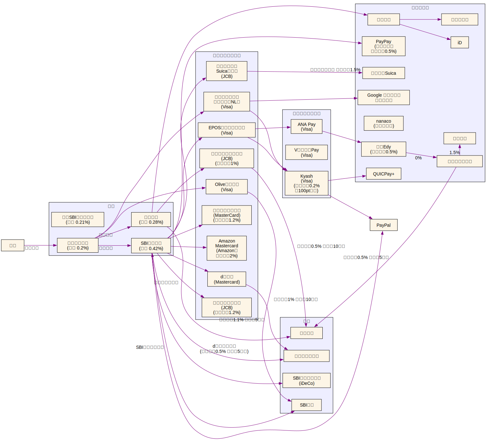

2026年年初時点での自分のお金周りの流れやポイ活について整理する

### [2024年末](../../../2024/12/money)からの変更点

- 追加
  - マネックス証券、dポイント、dカード
  - Oliveゴールド
- 削除
  - Oliveプラチナプリファード
- 変更
  - 楽天カード ゴールドへ
  - EPOSカード ゴールドへ
  - SBI新生コネクト から SBIハイパー預金
- 銀行の金利が上がった

## 雑感

ポイントゲットするためにカードを増やしたが、流石にカード増えてきたので落ち着いたら減らしていきたい

## お金の流れ

<!-- dot -Tsvg money.dot -o money.svg -->

### ポイント

| ポイント名                | 使用方法                                                  |
| ------------------------- | --------------------------------------------------------- |
| Vポイント                 | 三井住友カードの支払い・SBI証券で使用                     |
| 楽天ポイント              | 楽天証券で使用                                            |
| ハピタス                  | PeX 経由で dポイント に交換                               |
| dポイント                 | マネックス証券で使用                                      |
| JREポイント               | モバイルSuicaで使用                                       |
| Ponta・リクルートポイント | ホットペッパービューティーやAmazonで使用、dポイントに交換 |
| エポスポイント            | Amazon ギフトカード or ANAマイレージ                      |
| Amazonポイント            | Amazonで使用                                              |
| ANAマイレージ             | 特典航空券 or ANA Pay にチャージ                          |

### 補足・メモ

- ネット証券のクレカ積立でポイントゲット
- 三井住友銀行 を 給与振込口座にすることで Olive で 月200pt
  - [給与受取口座をOliveにするとおトク！ ： 三井住友銀行](https://www.smbc.co.jp/kojin/open-account/salary_new/)
- dポイント は 増量キャンペーン中に移行するとお得
- Kyashはポイント還元率が低いので、別になくてもいい
  - クレカチャージできるので、年間利用額の調整するのに便利…と思っていたが、三井住友カードは2026年3月1日から対象外になる

<!--
- ETC カードが無料で作れるもの
  - リクルートカード(JCB)
  - EPOSカード
-->

#### 三井住友カード ゴールド（NL）のポイント還元率

最大効率で還元率2%

詳細

- 通常 0.5%
- マイ・ペイすリボの特典 +0.5%
  - ※2024年6月に設定する必要があり、新規での設定は不可
  - 毎月利用額の調整が必要
- 100万円利用で1万ポイント
- 合計: 年間100万円ぴったり利用すると2万ポイント、還元率2%
- 初年度は年会費5500円で、いわゆる100万円修行で次年度から永年無料
  - 初年度は 年間100万円ぴったり利用すると 還元率1.45%
- [対象のコンビニ・飲食店で最大7％還元！｜クレジットカードの三井住友VISAカード](https://www.smbc-card.com/nyukai/pop/proper_p5.jsp)
  - コンビニの還元率が高い

#### EPOSカードのポイント還元率

100万円ぴったり利用して1.5%

詳細

- 通常 0.5%
- 100万円利用で1万ポイント
- [選べるポイントアップショップ](https://www.eposcard.co.jp/pointup/index.html) で2倍
  - 自分は下記を設定
    - ＮＨＫ放送受信料
    - 東京電力
    - JR東海 … スマートEX で東海道新幹線

## 投資信託

資産運用は [普通の人が資産運用で99点をとる方法とその考え方 - hayato](https://hayatoito.github.io/2020/investing/) を参考にインデックス投資している

- ポートフォリオ
  - S&P500
  - オルカン
- SBI証券
  - 新NISA口座
    - ボーナス月設定で年始に成長投資枠をほぼ埋める
    - 後は積立設定
  - 特定口座
  - iDeCo
- 楽天証券
  - つみたてNISA口座
    - 2023年まで積み立てていた
    - つみたてNISAの非課税期間が2039年に終わるはず
  - 特定口座
- マネックス証券
  - 特定口座

## 普段の生活

- 家計簿は[マネーフォワード ME](https://moneyforward.com/) を使用
- セール活用
  - セール品はあまり興味なく、ポイント還元狙い
    - 緊急度が低いものをメモしておいて買う
  - 楽天スーパーSALE
    - 3, 6, 9, 12月の4日
      - 5と0のつく日にエントリーするとお得
  - Amazon
    - Kindle まとめ買いキャンペーン
- ハピタス か 楽天リーベイツ 経由で買い物
  - iHerb
  - ユニクロ
  - Apple
  - 楽天トラベル
- セブンイレブンとローソンではクレカのタッチ決済を使う
- 楽天ペイが使えるところではそれを使う
- 格安SIM [合理的シンプル290プラン｜日本通信SIM](https://www.nihontsushin.com/plan/plansimple.html)
  - 外であまりネットを使わないので平均すると月1000円くらい
    - 出先ではタブレットに入れた電子書籍で暇つぶしすることが多い
    - docomo回線かつMVNOなので駅など電波が悪くて割り切って使っている

### 節税

- ふるさと納税
  - ちゃんと出身地にも寄付している
